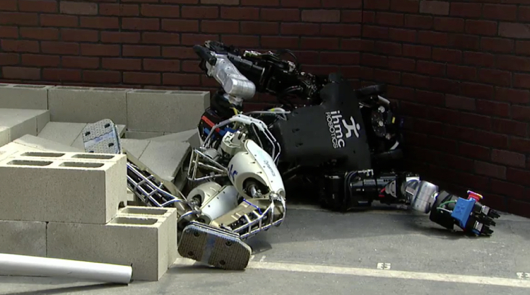
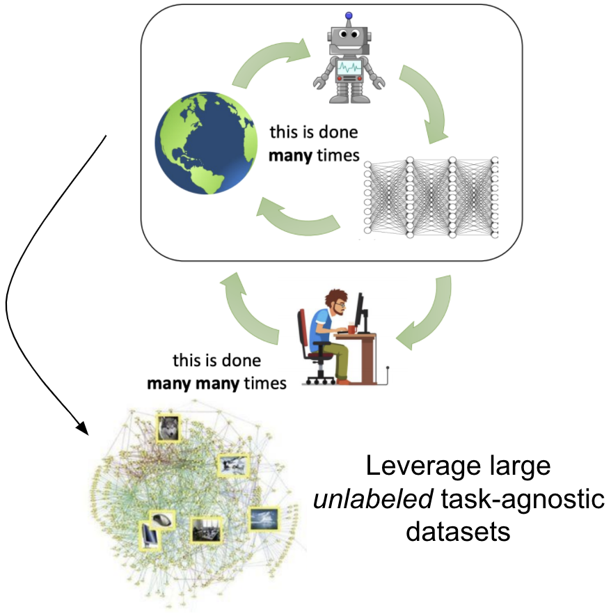
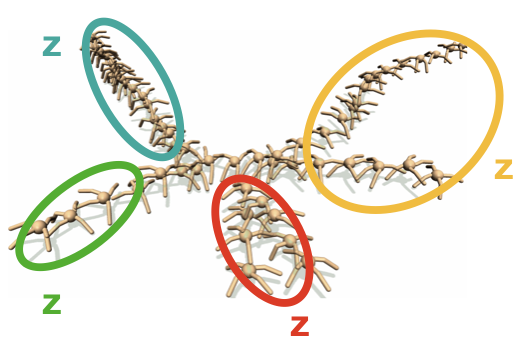
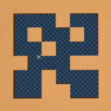
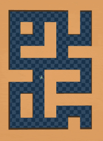
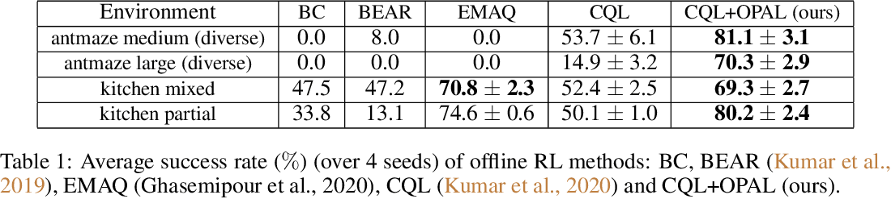
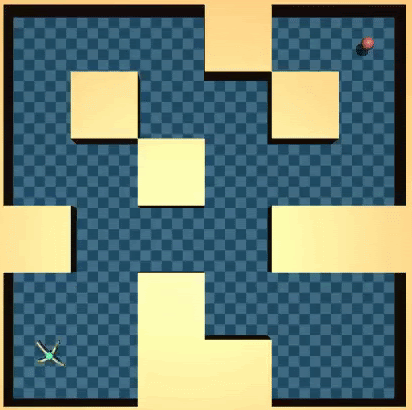
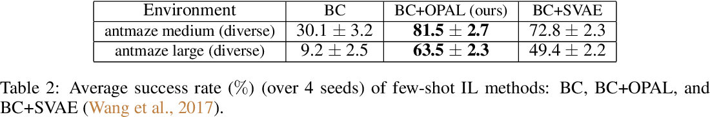
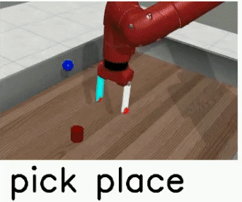
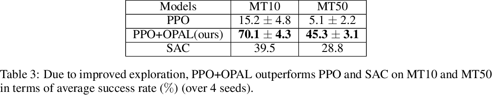

# Leveraging task-agnostic datasets

Several practical concerns may limit the agent’s ability to act directly in the real world. For example, consider the Atlas robot learning via trial and error. This could cause the Atlas to fall frequently requiring costly human supervision for checks and resets (Atkeson et al., 2015)[^1], thereby rendering many standard online RL algorithms inapplicable (Matsushima et al., 2020)[^2].

<figure>
    
    
    <div style='margin-left: 450px; height: auto, display:inline;'>(Taken from berkeley CS 285)</div>
</figure>

Instead of online interaction, we might have access to large amounts of previously logged data. This data can come from a potentially sub-optimal, but safe hand-engineered policy. We can use these exploratory past data to learn a task policy offline. This problem setup is called offline RL. Despite having tremendous practical applications, offline RL remains limited in its use due to various optimization issues (Levine et al., 2020)[^3]. Prior work (Shankar et al., 2020)[^4] in online RL used temporally extended skills (aka *primitives* (Sutton et al., 1998)[^5]) to extract a **compact action space.** This improves performance by **effectively** reducing the task horizon and** thereby helping in **better credit assignment**. However, it remains unclear if such primitives can help with offline RL.

<figure>
    
    
    
</figure>

In this work, we investigate whether learning *primitive* skills in an unsupervised manner can benefit learning in the offline setup. For example, consider a dataset of an ant robot exploring mazes as shown above. While this dataset does not provide a trajectory that goes directly towards the intended goal, it does offer knowledge of what type of extended behavior is useful for exploring the maze (e.g., moving forward, left, right, and backward). Our unsupervised learning objective aims to distill these behaviors into a continuous space of latent vectors z, which can be decoded into primitives using a latent-conditioned policy. Empirically these primitives correspond to useful behaviors such as walking in different directions indicated by different colors in the figure above. Once we extract these primitives, we can use the latent vectors $z$ as a compact temporally extended action space for learning a task policy with offline RL. Since the task policy only needs to combine the task-relevant skills and not focus on learning how to locomote, the task learning becomes easier.

We refer to our proposed framework of using unsupervised learning to extract primitives for offline policy optimization as OPAL. We apply this paradigm to offline RL, where the agent is given a single offline dataset for both the initial unsupervised learning phase and then a
subsequent task-directed offline policy optimization phase. Despite not using any additional online data, OPAL can dramatically improve offline policy optimization compared to optimizing offline policy directly on action space. We will now describe our method in detail.

# Offline Reinforcement Learning with OPAL

<figure>

</figure>

We extract a continuous space of temporally-extended primitives $\pi_\theta(a|s, z)$ from $\mathcal{D}$ using a generative model inspired from $\beta$-VAE (Higgins et al., 2016)[^6]. This model encodes state-action trajectory $\tau$ int to latent $z$ $\big($i.e., encoder $q_\phi(z|\tau)$ $\big)$ which can be decoded into a sequence of $c$ actions with state-conditioned *primitive policy* $\pi_\theta(a|s,z)$. To regularize the latent space we constrain the extracted latent $z$ to be predictable from the first state of the trajectory using *prior* $\rho_w(z|s)$. This regularization has been shown to be useful in prior work (Lynch et al., 2019)[^7]. The model is trained by optimizing

$$
\max_{\theta, \phi, \omega} \mathbb{E}_{\tau\sim\mathcal{D},z \sim q_\phi(z|\tau)}\left[\sum_{t=0}^{c-1} \log \pi_\theta(a_t|s_t,z) \right] - \beta\text{D}_{\text{KL}}(q_\phi(z|\tau)||\rho_\omega(z|s_0))
$$

After learning the above generative model, we can relabel the dataset using the *encoder* to get high-level transitions $(s_0, z, s_c,\sum_{t=0}^{c-1}\gamma^tr_t)$ and low-level transitions $\{(s_t, a_t, z)_{t=0}^{c-1}\}$. Even though we train both the encoder and the primitive policy together, they might still be inconsistent with one another. This is because the primitive policy tries to adapt to the latent vectors z, inferred by a changing encoder. In theory, training both the encoder and the primitive policy for many epochs could resolve the issue. In practice, we found fine-tuning the *primitive policy* using low-level transitions $(s_t, a_t, z)$ with behavioral cloning was sufficient to ensure consistency with the encoder. After fine-tuning the primitive policy, we train a task level policy $\pi_\psi(z|s)$ using high-level transitions with offline RL. We use Conservative Q-Learning (CQL) (Kumar et al., 2020)[^8] as our offline RL algorithm.
As a result of learning the task policy on temporally extended primitives, we are able to make significant gains on antmaze and kitchen tasks taken from D4RL (Fu et al., 2020)[^9].

<figure>

</figure>

# Leveraging OPAL for other uses

Finally, we can also use the learned primitives to improve online RL, few-shot imitation learning, and multi-task transfer learning. 

## Few-shot Imitation Learning

<figure>
    
    
</figure>

Previously, we assumed that we have access to a task reward function, but only undirected data that just explore the environment. Now, we will study the opposite case, where we are not provided with a reward function for the new task either, but instead, receive a small number (i.e. 10) of task-specific demonstrations that illustrate optimal behavior (see figure above). Simply imitating these few demonstrations is insufficient to obtain a good policy. 

However, our experiments show that relabeling these demonstrations with their inferred primitives and then imitating these primitives leads to a much better policy in this setting. 

<figure>

</figure>

## Online Multi-task transfer

Till now, we have learned the task policy offline either with offline RL or imitation learning. We will now leverage the learned primitives to learn the task policy online in multi-task settings. We learn primitives with expert data from pick-and-place task and then use it to learn multi-task policy for Multi-task 10 and Multi-task 50 benchmarks (from metaworld (Yu et al., 2020)[^10]), containing 10 and 50 robotic manipulation tasks which needs to be solved simultaneously, as shown in the figure below. See table 4 for results.

<pre class="tab">     r<b>Source Task</b>                     <b>Transfer Tasks</b> </pre>

<figure>
    
    
</figure>

<figure>

</figure>

# Related Work and Future Perspectives

OPAL is most similar to PARROT (Singh et al., 2021)[^11] when it comes to extracting primitives from exploratory datasets of diverse behaviors. However, OPAL uses a VAE model for extracting primitives while PARROT uses normalizing flows for the same. Furthermore, OPAL is primarily evaluated on offline RL while PARROT is mainly evaluated on online visual transfer learning.

In our work, we focused on simple auto-encoding models for representing primitives. An interesting avenue for future work is scaling up this basic paradigm to more complex image-based tasks with:

- **Better Visual Encoder.** In this work, we assumed access to the state representation of the environment. In the real world, OPAL needs to work from raw observations such as images. Hence, an important future direction is to use better visual encoders (eg. Vision transformers (Dosovitskiy et al., 2021)[^12]) to obtain a compact representation of image observations and then use OPAL on the compact representation.
- **Multi-modal primitive distribution.** In this work, we model the primitive distribution as a gaussian. However, this can be limited in its ability to model multi-modal distributions. Thus, another important future direction is to use either Gaussian Mixture Models or Normalizing flows (Dinh et al., 2017)[^13] for modeling multi-modal primitive distribution.

**Bibtex**

```
@article{ajay2020opal,
  title={Opal: Offline primitive discovery for accelerating offline reinforcement learning},
  author={Ajay, Anurag and Kumar, Aviral and Agrawal, Pulkit and Levine, Sergey and Nachum, Ofir},
  journal={arXiv preprint arXiv:2010.13611},
  year={2020}
}
```

Link to the [Slides](https://drive.google.com/file/d/1PfxFOTY1HjR5jdgHeRtGBR1MoS2fSlbS/view) and [Poster](https://drive.google.com/file/d/1To5N1lg3CMrTkI-hT7Viw4LtaJWaRXis/view)

# References

[^1]: Christopher G Atkeson, Benzun P Wisely Babu, Nandan Banerjee, Dmitry Berenson, Christoper PBove, Xiongyi Cui, Mathew DeDonato, Ruixiang Du, Siyuan Feng, Perry Franklin, et al. *No falls, no resets: Reliable humanoid behavior in the darpa robotics challenge.* IEEE Humanoids, 2015.

[^2]: Tatsuya Matsushima, Hiroki Furuta, Yutaka Matsuo, Ofir Nachum, and Shixiang Gu. *Deployment-efficient reinforcement learning via model-based offline optimization*. arXiv, 2020.

[^3]: Irina Higgins, Loic Matthey, Arka Pal, Christopher Burgess, Xavier Glorot, Matthew Botvinick, Shakir Mohamed, and Alexander Lerchner. *beta-vae: Learning basic visual concepts with aconstrained variational framework.* 2016.

[^4]: Sergey Levine, Aviral Kumar, George Tucker, and Justin Fu. *Offline Reinforcement Learning: Tutorial, Review, and Perspectives on Open Problems*. arXiv, 2020.

[^5]: Aviral Kumar, Aurick Zhou, George Tucker, and Sergey Levine. *Conservative q-learning for offline reinforcement learning*. NeurIPS, 2020.

[^6]: Justin Fu, Aviral Kumar, Ofir Nachum, George Tucker, and Sergey Levine. *D4rl: Datasets for deep data-driven reinforcement learning*. arXiv, 2020.

[^7]: Tianhe Yu, Deirdre Quillen, Zhanpeng He, Ryan Julian, Karol Hausman, Chelsea Finn, and Sergey Levine. *Meta-world: A benchmark and evaluation for multi-task and meta reinforcement learning.* CORL, 2020.

[^8]: Ofir Nachum, Shixiang Gu, Honglak Lee, and Sergey Levine. *Near-optimal representation learning for hierarchical reinforcement learning.* ICLR, 2018.

[^9]: Corey Lynch, Mohi Khansari, Ted Xiao, Vikash Kumar, Jonathan Tompson, Sergey Levine, and Pierre Sermanet. *Learning Latent Plans from Play.* CORL, 2019.

[^10]: Tanmay Shankar, and Abhinav Gupta. *Learning Robot Skills with Temporal Variational Inference.* ICML, 2020.

[^11]: Alexey Dosovitskiy, Lucas Beyer, Alexander Kolesnikov, Dirk Weissenborn, Xiaohua Zhai, Thomas Unterthiner, Mostafa Dehghani, Matthias Minderer, Georg Heigold, Sylvain Gelly, Jakob Uszkoreit, and Neil Houlsby. *An Image is Worth 16x16 Words: Transformers for Image Recognition at Scale.* ICLR, 2021.

[^12]: Rich Sutton, Doina Precup, and Satinder Singh. *Between MDPs and semi-MDPs: A framework for temporal abstraction in reinforcement learning.* Elsevier, 1998.

[^13]: Laurent Dinh, Jascha Sohl-Dickstein, and Samy Bengio. *Density estimation using real NVP*. ICLR, 2017.