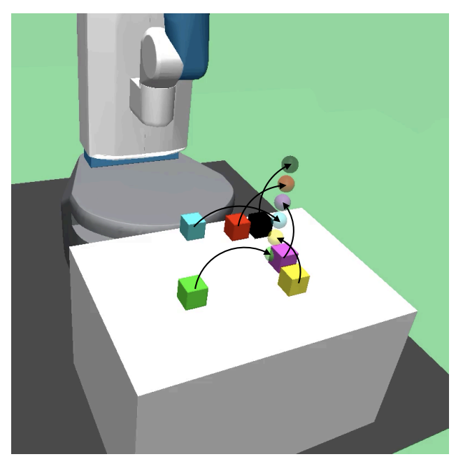
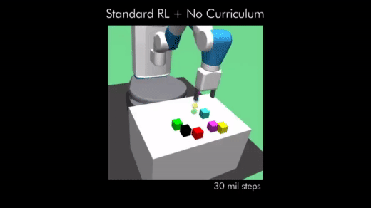
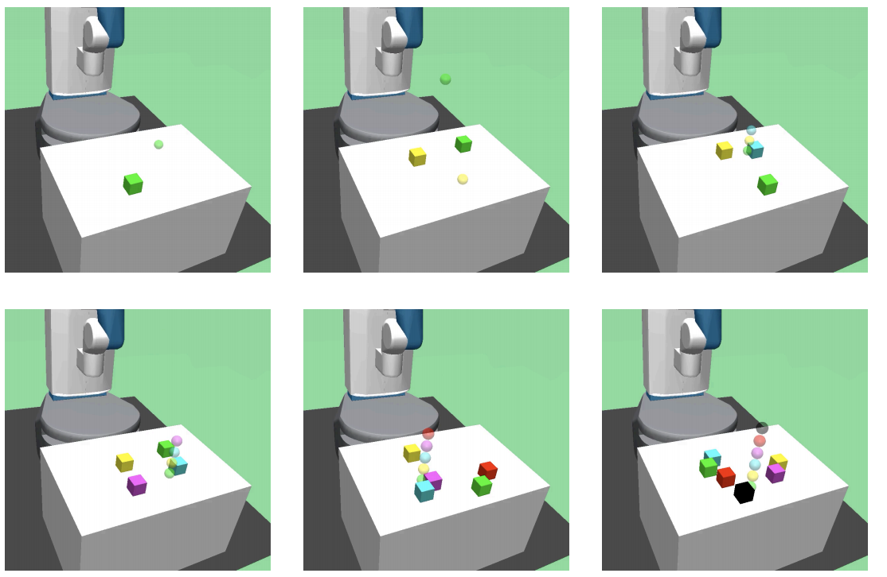
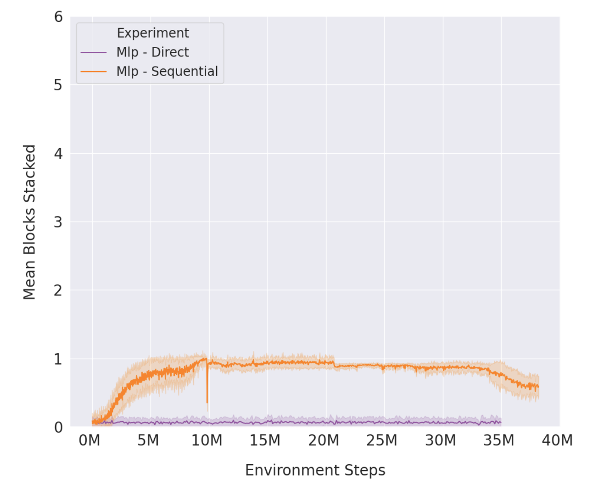
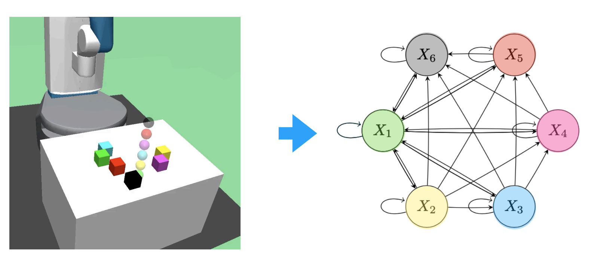
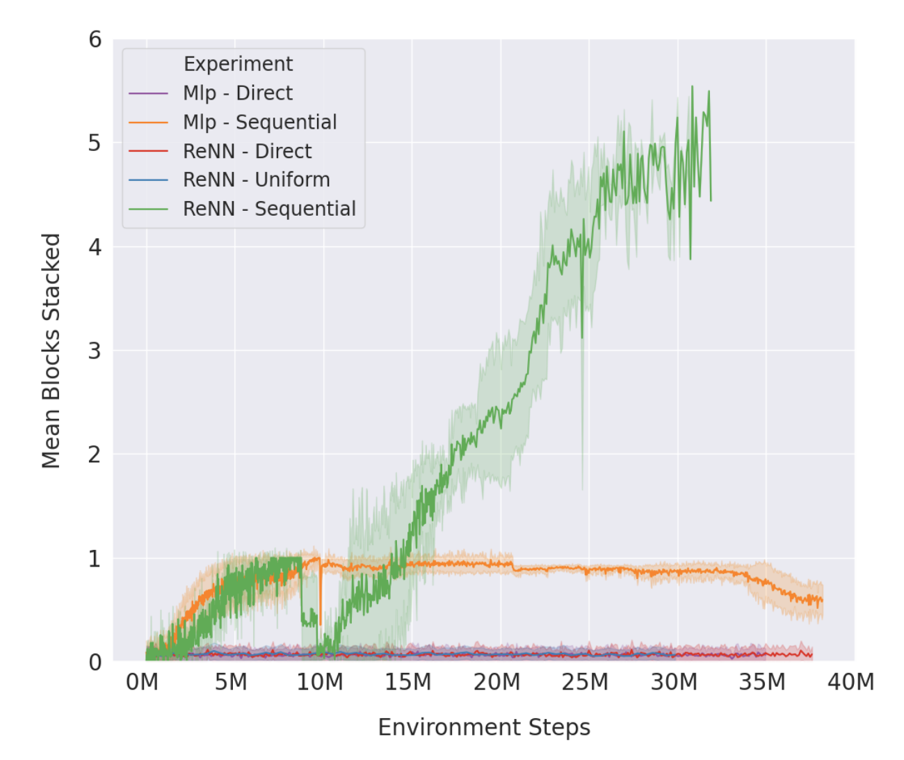
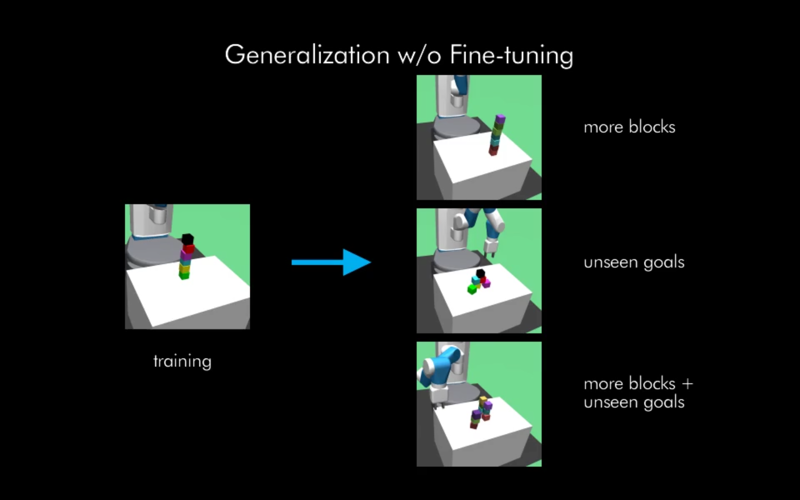

import Video from "../../../../components/video.js"

Solving complex manipulation tasks involving multiple objects is currently impractical for many reinforcement learning (RL) algorithms due to the long time horizon and the increase in state space with the number of objects. These task characteristics make credit assignment and exploration difficult. Several techniques are commonly used to mitigate these challenges: (i) reward engineering, (ii) expert demonstrations, and (iii) task curriculum. Reward engineering refers to the process of designing a dense reward, which scores the agent's actions at most time-steps. It is well known that reward engineering is time-consuming and can lead to unexpected behaviors ("[reward hacking](https://www.alexirpan.com/2018/02/14/rl-hard.html)"). Alternatively, we might provide the robot with human demonstrations of the task. However, demonstrations are time-consuming, tedious to generate and existing approaches[^1] still require large amounts of interaction data[^2][^3][^4][^5][^6].

We opt for the third technique of providing a task curriculum where a sparse reward is associated with each stage of the curriculum. Using a curriculum involves training the agent to solve a sequence of tasks of increasing difficulty. Curriculum and a sparse reward can be much easier to specify than a dense reward. For example, imagine designing a dense reward for picking and placing a block at the desired goal position ($s_g$).  In order for our agent to learn effectively, we might use the following reward function:

$$
\begin{aligned}
    R &= R_{\text{reach}} + R_{\text{grasp}} + R_{\text{place}} \\
    &= - ||s_h - s_o||_2 + c_1 \cdot \mathbb{I}_{|| s_h - s_o||_2  \lt \epsilon} \cdot \mathbb{I}_{s_c} - c_2 \cdot \mathbb{I}_{s_c} \cdot \exp{\frac{||s_o - s_g||^2}{c_3}}
\end{aligned}
$$

Definitions:

- $s_h$: gripper ("hand") position
- $s_o:$ object current position
- $s_c$: binary variable for gripper open
- $s_g$: object goal position

Coming up with the precise functional form and tuning the coefficients $c_1, c_2, c_3$ is generally unintuitive. Even experienced RL engineers find it difficult to design dense reward functions!

Instead of a dense reward function, it is usually simpler to specify a curriculum and a sparse reward. The reasoning is that designing a curriculum only requires judging the task difficulty, which can be much easier than designing and tuning a dense reward function. For example, we intuitively know that tasks with fewer objects are easier to solve than tasks with more objects. In contrast, it's much harder to reason whether increasing $c_1$ relative to $c_2$ in the reward function will help our agent learn faster or not.

Let us consider the task of stacking multiple blocks into a tower. This task has a long time horizon and involves a large state space. It admits a simple step-wise sparse reward: the agent is rewarded $+1$ for placing each block into a corresponding target position, and $0$ otherwise.

Blocks must be placed into a stacked goal position denoted by the colored sphere of the corresponding color.

The agent takes as input a set of state vectors, with one state vector per block comprised of the block's position, orientation, and velocity. The action space is the relative change in position of the end effector and a binary open-or-close command for the gripper.

Standard RL fails to perform the task of stacking six blocks using the sparse reward. The agent is unable to stack even a single block! This illustrate the hardness of the task.

These videos show the rollouts of the RL agent during training, evaluated at different total environment steps.

What if, instead, we train using a task curriculum? We design a simple curriculum where the number of blocks increases by one in each stage. We denote this curriculum as the **Sequential** curriculum in the reward curve plot below.

Our curriculum of six stages where each stage adds a block

The agent's progress still stalls at the second stage as seen in the yellow curve below. This agent uses a multilayer perceptron (MLP) architecture for encoding the environment state.

Plot showing the average blocks stacked for an MLP architecture using two different task distributions

The reason for failure is that the agent is unable to transfer its stacking knowledge across different stages of the curriculum. The lack of transfer can be attributed to the failure of the policy operating from the state space $\{ x_1, ..., x_n \}$ to generalize to the state space obtained in the next stage of the curriculum, after we add a new block $x_{n+1}$: $\{ x_1, ..., x_n, x_{n+1}\}$.

Different architectures handle the changes in the state space differently. For an MLP, the input dimension of the first fully-connected (FC) layer is increased to support an additional block, and these new weights are randomly initialized. The issue in this approach is that the distribution of activations throughout the network may drastically change due to the modification in the input of the first FC layer. Consequently, the knowledge from previous tasks is not effectively transferred.

To overcome this issue, we utilize an architecture called *ReNN - Relational Neural Network,* which consists of a series of [self-attention layers](https://arxiv.org/abs/1706.03762) and a final pooling operation to output an action. Unlike fully connected networks, self-attention can effectively represent sets of arbitrary size. Therefore, it is possible that *ReNN* succeeds at transferring the stacking policy between subsequent stages in the curriculum. Empirically, we indeed find this transfer to occur.

Depiction of the state space graph, which is provided by the environment at each timestep. Node $X_i$ represents the state of block $i$ (colored accordingly). Edges between nodes represent physical interactions, which are implicitly modeled by self-attention.

**We found that the self-attention architecture and the task curriculum are both necessary to efficiently solve our final task of stacking six blocks.**

Plot showing the average number of blocks stacked with respect to total environment steps. If there is a curriculum, the total environment steps include steps from all previous stages of the curriculum.

In the above figure, we see that the green line which uses our self-attention network (*ReNN*) along with a sequential curriculum, as described previously, outperforms the other ablations by far, and is the only experiment that was able to progress beyond two blocks stacked. For more information about the architecture/curriculum ablations, please refer to the [paper](https://arxiv.org/abs/1912.11032).

Training with this method requires orders of magnitude fewer interactions and substantially outperforms the [previous best method](https://arxiv.org/abs/1709.10089) relying on demonstrations to accelerate exploration.

$$
\begin{array}{|c | c |c |}\hline
     \text{  } & \text{ Nair '18 } & \text{ Ours } \\\hline
     \text{Success Rate}       & 32\%           & \mathbf{75\%} \\\hline
     \text{Environment Steps}     & 2300\text{M}              & \mathbf{30M} \\\hline
\end{array}
$$

## Emergent behaviors

An interesting benefit of training an RL agent with sparse reward is that it automatically learns complex behaviors that improve task performance but are extremely difficult to program by hand. We call these emergent behaviors. Some examples of such behavior are:

- **Singulation**: In order to not knock over the tower, the agent separates  (i.e. *singulates*) the black block away from the other blocks before picking it up.
- **Pushing while grasping**: The agent performs a rolling/pushing behavior on the green block while grasping the blue block. This behavior reduces the time required for block stacking.
- **Simultaneous pick-and-place of two objects**: The agent collects the blue and yellow blocks in hand before placing each one by one, thus reducing the time it takes to stack blocks.

Singulation

<Video src="relation_rl/singulation.mp4" alt="Singulation"/>

Pushing while grasping

<Video src="relation_rl/pick2place2.mp4" alt="pick2place2"/>

Simultaneous pick-and-place of two objects

## Zero-shot Generalization

We found that the relational inductive biases of the self-attention architecture were very useful for certain kinds of zero-shot generalization - to more objects in the scene and new goal configurations of the objects. Visualization of these behaviors is shown below.

An agent trained on stacking 6 blocks into a single tower (left) generalizes to various configurations with more blocks and new goals (right).

## Future Perspectives

While we are able to stack towers with cubes, there is a lot still to be done! We think the following are some exciting directions for future work:

- **Raw observations:** In this work, we assumed access to the object position, velocity, and other state measurements. In reality, our control algorithm must work from raw observations, such as camera images or point clouds, in order to be deployed on a real robot.
- **Shape generalization:** A fully general stacking system should be able to stack objects of arbitrary shapes, instead of just cubes. Generalizing to arbitrary shapes presents two major challenges:
    - **Sample-efficient RL over raw observations**: Training RL over raw observations can be prohibitively [expensive](https://arxiv.org/abs/2101.04882), requiring hundreds of GPUs. One option is to pre-train on some other task to learn an efficient shape representation and finetune on the object manipulation task. The choice of pre-training task and how to finetune in the RL setup are [open](https://arxiv.org/pdf/1906.11883.pdf) [research](https://arxiv.org/pdf/1903.06684.pdf) [questions](https://arxiv.org/pdf/1910.11977.pdf). It is therefore important to come up with new representations or training strategies that can significantly speed up RL training over raw observations.
    - @Richard Li lets add one more point on how to represent shapes and orientations with symmetric objects is an open challenge etc. Talk about PointNet, PointNet++ and their weaknesses.
    - **Automatic curriculum design**: The main task variation we tackled in this work was object cardinality. Smaller numbers of objects were easier to train than larger numbers of objects, and we used this principle to design our curriculum. But what if our task variation involved something more complicated, such as the object shape? It is unclear *a priori* what shapes are easier to stack than other shapes, which means we won't be able to make a simple hand-designed curriculum. Instead, we may need to look into techniques for [automatically](https://arxiv.org/abs/1707.05300) [generating](https://arxiv.org/abs/1707.00183) [curricul](https://arxiv.org/abs/2101.04882)a.

**This post is based on the following paper:**

- [Towards Practical Multi-Object Manipulation using Relational Reinforcement Learning](https://arxiv.org/pdf/1912.11032.pdf) by Richard Li, Allan Jabri, Trevor Darrell, and Pulkit Agrawal

**Additional resources:**

- Talk describing the paper delivered virtually at ICRA 2020.

    [ ICRA2020_presentation_v9_recording.m4v]( relation_rl/ICRA2020_presentation_v9_recording.m4v)

- Project Slides

    [ICRA2020 Slides]( ICRA2020_presentation_v9_no_presenter.pdf)

- [Project Page](https://richardrl.github.io/relational-rl/)
- [Github](https://github.com/richardrl/rlkit-relational)

**Acknowledgements:**

Thanks to Andi Peng, Tao Chen, Anthony Simeonov, and Ge Yang for giving feedback and reading earlier drafts of this blog post.

## References

[^1]: A. Nair, B. McGrew, M. Andrychowicz, W. Zaremba, and P. Abbeel, “[Overcoming exploration in reinforcement learning with demonstrations](https://arxiv.org/abs/1709.10089),” *CoRR 2017*.

[^2]: V. Zambaldi, D. Raposo, A. Santoro, V. Bapst, Y. Li, I. Babuschkin, K. Tuyls, D. Reichert, T. Lillicrap, E. Lockhart, et al., “[Deep reinforcement learning with relational inductive biases](https://openreview.net/pdf?id=HkxaFoC9KQ),” International Conference on Learning Representations, 2019.

[^3]: P. Battaglia, R. Pascanu, M. Lai, D. J. Rezende, and K. Kavukcuoglu, “[Interaction networks for learning about objects, relations and physics](https://arxiv.org/abs/1612.00222),” in Proceedings of the 30th International Conference on Neural Information Processing Systems, 2016.

[^4]: Y. Duan, M. Andrychowicz, B. Stadie, O. Jonathan Ho, J. Schneider, I. Sutskever, P. Abbeel, and W. Zaremba, “[One-shot imitation learning](http://papers.nips.cc/paper/6709-one-shot-imitation-learning.pdf),” in Advances in Neural Information Processing Systems, 2017.

[^5]: M. Janner, S. Levine, W. T. Freeman, J. B. Tenenbaum, C. Finn, and J. Wu, “[Reasoning about physical interactions with object-oriented prediction and planning](https://arxiv.org/abs/1812.10972),” in International Conference on Learning Representations, 2019.

[^6]: OpenAI, M. Plappert, R. Sampedro, T. Xu, I. Akkaya, V. Kosaraju, P. Welinder, R. D’Sa, A. Petron, H. P. de Oliveira Pinto, A. Paino, H. Noh, L. Weng, Q. Yuan, C. Chu, and W. Zaremba, “[Asymmetric self-play for automatic goal discovery in robotic manipulation](https://arxiv.org/abs/2101.04882),” CoRR 2021.